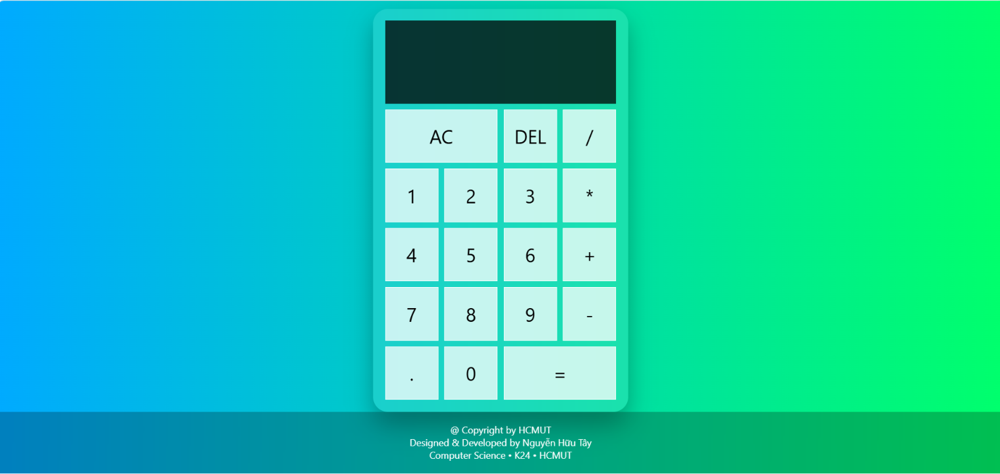

## Calculator Web Application
```
Một simple calculator web application built with HTML, CSS, Javascript
```
## Overview 
```
This project is a simple calulator with basic operation including : 
- Addition (+)
- Substraction (-)
- Multiplication (*)
- Division (/)
- Delete (DEL)
- All clear (AC)
```

## Technology Used 
```
- HTML5
- CSS3
- Javascript
```
## Directory Structure 

```text
calculator-website/
|
|__ index.html
|
|
|__ style.css
|
|
|__ script.js
|
|
|__ readme.md
```

## Installation

Clone the repository: 
```
git clone  https://github.com/Bluehope-dream/Calculator-Website.git
```

Open index.html in your browser.

## Live Demo
```
 https://bluehope-dream.github.io/Calculator-Website/
 ```


## Author 
```
Bluehope (HCMUT)

Computer Science Student (K24)

Ho Chi Minh University of Technology .

```